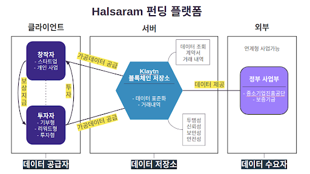

# Blockchain based Crowd-Funding Platform Dev-Project

## Translations
- [한국어](/translations/ko.md) 🇰🇷

## Team members
- 정휘선, 이은미, 전새희, 이동호, 금정민, 최다올


## Architecture


## Pre-Installed
The following libraries / Framework are pre-installed.

### React.js and core framework
- [Next.js](https://nextjs.org)
- [TypeScript](https://www.typescriptlang.org)
- [Babel](https://babeljs.io)
- [Express.js](https://expressjs.com)

### GraphQL
- [Apollo Client](https://github.com/apollographql/apollo-client)
- [React Apollo](https://github.com/apollographql/react-apollo)
- [React Apollo Hooks](https://github.com/trojanowski/react-apollo-hooks)
- [GraphQL Code Generator](https://graphql-code-generator.com)

### State Management
- [MobX 5](https://github.com/mobxjs/mobx)
- [mobx-state-tree](https://github.com/mobxjs/mobx-state-tree)

### Styling
- [styled-components](https://www.styled-components.com)

### Asset Management
- [next-optimized-images](https://github.com/cyrilwanner/next-optimized-images)

### Deployment
- [Serverless Framework](https://serverless.com)
- [AWS Lambda](https://aws.amazon.com/lambda)
- [Dotenv](https://github.com/motdotla/dotenv)

## 1. Getting Started
```bash
# Clone the repository
$ git clone https://github.com/halsaram/project-www.git
$ cd project-www

# Flush git project
$ rm -rf .git

# Initialize your own git project
$ git init

# Install yarn
$ curl -sS https://dl.yarnpkg.com/debian/pubkey.gpg | sudo apt-key add -
$ echo "deb https://dl.yarnpkg.com/debian/ stable main" | sudo tee /etc/apt/sources.list.d/yarn.list
$ sudo apt-get update && sudo apt-get install yarn

# Install dependencies
$ yarn

# Start development server
$ yarn dev
```

## 2. Folder Structure
### 5. `/src/pages`
File-based page routing. All the aliases are handled through `export {default}`, but all implementations are done inside `/services`.
```typescript
export { default } from '~/services/home/pages/index'
```
> I've separated the code with service module for future scalability. Separate common elements used in page implementations such as `/queries`, `/helpers`, `/components` by service name [https://softwareengineering.stackexchange.com/questions/338597/folder-by-type-or-folder-by-feature](https://softwareengineering.stackexchange.com/questions/338597/folder-by-type-or-folder-by-feature)

If you set `generatePageAliases` to `true` in `options.json`, this boilerplate traverse all `/services/**/pages/**.tsx` and generate page aliases in `/pages` automatically when `yarn dev`.

## 3. Development
```bash
# Start development server
$ yarn dev
```

## 4. Build
```bash
# Build server and client bundles
$ yarn build
```

## 5. Error
```bash
# wapack error
$ echo fs.inotify.max_user_watches=524288 | sudo tee -a /etc/sysctl.conf && sudo sysctl -p
```

---

